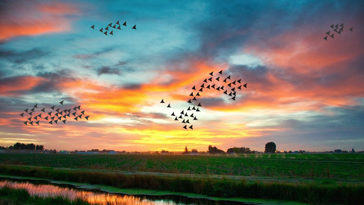

# Fenland Boid Friends
  

Animated birds flying in the Fens. Built with Pygame; based on Craig Reynolds' [*Boids*](https://en.wikipedia.org/wiki/Boids).  

To play:
- pip install pygame  
- run main.py  
- click to add a new boid  
- press any key to scatter boids
- alter variable values in main.py lines 18-27 for different flocking results
